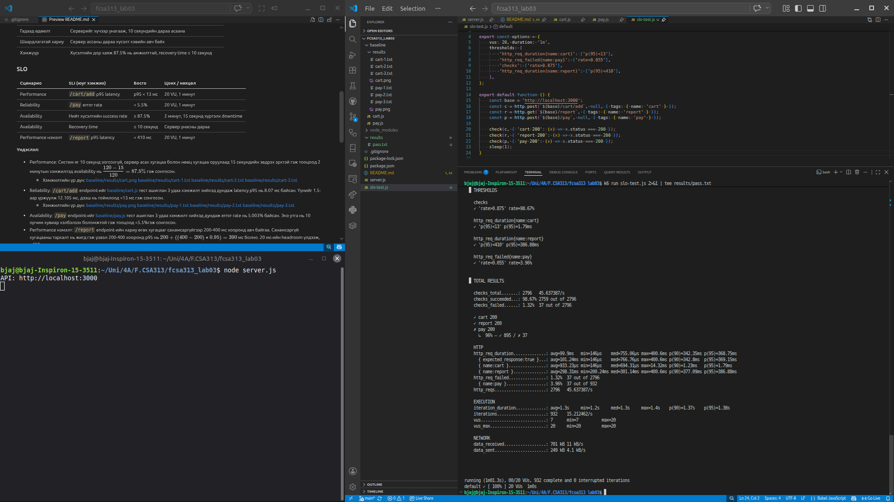
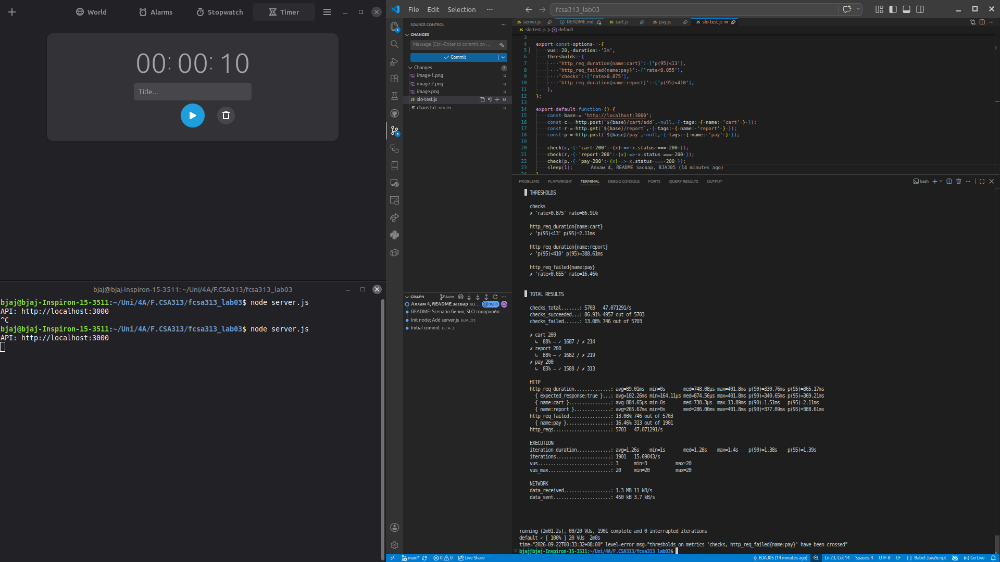

# Лаб 03 - B232270068 А.Баяржавхлан

k6 хувилбар: `k6 v2.2.0 (commit/00a9a1b7f5, go1.26.5, linux/amd64)`

## Сценарио

|                    | Performance сценарио                                                      |
| ------------------ | ------------------------------------------------------------------------- |
| Тойм               | Хэвийн ачаалалд `/cart/add` endpoint-ийн хариу өгөх хугацаа ямар байх вэ  |
| Системийн төлөв    | Сервер хэвийн ажиллагаатай, сагсны өгөгдлийг санах ойд боловсруулж байгаа |
| Орчны төлөв        | Сүлжээ болон локал орчин хэвийн, ямар нэг тасалдалгүй                     |
| Гадаад өдөөлт      | 20 VU 1 минутын турш тасралтгүй POST хүсэлт илгээнэ                       |
| Шаардлагатай хариу | Сервер хүсэлт бүрийг хурдан боловсруулж, 200 статус буцаана               |
| Хэмжүүр            | Latency p95 нь 13 мс-ээс бага байна                                       |

|                    | Reliability сценарио                                                         |
| ------------------ | ---------------------------------------------------------------------------- |
| Тойм               | Хэрэглэгч төлбөр төлөх үйлдэл хийхэд `/pay` endpoint-ийн эвдрэлийн давтамж   |
| Системийн төлөв    | Сервер ажиллаж байгаа, гэхдээ хүсэлтийн 5% нь санамсаргүйгээр алдаатай болно |
| Орчны төлөв        | Локал орчин хэвийн, алдааг `/pay` endpoint дотор симуляц хийнэ               |
| Гадаад өдөөлт      | 20 VU 1 минутын турш тасралтгүй төлбөр төлөх үйлдэл хийнэ                    |
| Шаардлагатай хариу | Систем алдаа гарахад унахгүй, алдаатай хүсэлтэд 500 статус буцаах            |
| Хэмжүүр            | Error rate нь 5.5%-аас бага байна                                            |

|                    | Availability сценарио                                              |
| ------------------ | ------------------------------------------------------------------ |
| Тойм               | Сервер унаад, гараар дахин асаах үед системийн бэлэн байдал        |
| Системийн төлөв    | Эхлээд сервер хэвийн ажиллаж байгаад унах үед хүсэлт авахаа болино |
| Орчны төлөв        | Байршуулсан төхөөрөмж болон үйлдлийн систем хэвийн                 |
| Гадаад өдөөлт      | Серверийг хүчээр унагааж, 10 секундийн дараа асаана                |
| Шаардлагатай хариу | Сервер ассаны дараа хүсэлт хэвийн авч байх                         |
| Хэмжүүр            | Хүсэлтийн дор хаяж 87.5% нь амжилттай, recovery time ≤ 10 секунд   |

### SLO

| Сценарио           | SLI (юуг хэмжих)            | Босго       | Цонх / нөхцөл                     |
| ------------------ | --------------------------- | ----------- | --------------------------------- |
| Performance        | `/cart/add` p95 latency     | p95 < 13 мс | 20 VU, 1 минут                    |
| Reliability        | `/pay` error rate           | < 5.5%      | 20 VU, 1 минут                    |
| Availability       | Нийт хүсэлтийн success rate | > 87.5%     | 2 минут, 10 секунд орчим downtime |
| Availability       | Recovery time               | ≤ 10 секунд | Сервер унасны дараа               |
| Performance нэмэлт | `/report` p95 latency       | < 410 мс    | 20 VU, 1 минут                    |

**Үндэслэл:**
- Performance: `/cart/add` endpoint-ийг [baseline/cart.js](baseline/cart.js) тест ашиглан 3 удаа хэмжилт хийхэд дундаж latency p95 нь 8.07 мс байсан. Үүнийг 1.5-аар үржүүлж 12.105 мс, дээш нь тоймлоод <13 мс гэж сонгосон.
    - Хэмжилтийн үр дүн: [baseline/results/cart.png](baseline/results/cart.png) [baseline/results/cart-1.txt](baseline/results/cart-1.txt) [baseline/results/cart-2.txt](baseline/results/cart-2.txt) [baseline/results/cart-3.txt](baseline/results/cart-3.txt)
- Reliability: `/pay` endpoint-ийг [baseline/pay.js](baseline/pay.js) тест ашиглан 3 удаа хэмжилт хийхэд дундаж error rate нь 5.003% байсан. Энэ утга нь 10 орчим хувиар хэлбэлзэх боломжтой гэж тооцоод <5.5%гэж сонгосон.
    - Хэмжилтийн үр дүн: [baseline/results/pay.png](baseline/results/pay.png) [baseline/results/pay-1.txt](baseline/results/pay-1.txt) [baseline/results/pay-2.txt](baseline/results/pay-2.txt) [baseline/results/pay-3.txt](baseline/results/pay-3.txt)
- Availability: Систем яг 10 секунд зогсохгүй, сервер асах хугацаа болон нөөц хугацаа оруулаад 15 секундийн эвдрэх эрхтэй гэж тооцоод 2 минутын хэмжилтэд availability нь $\dfrac{120-15}{120}=87.5\%$ гэж сонгосон.
- Performance нэмэлт: `/report` endpoint-ийн хариу өгөх хугацааг санамсаргүйгээр 200-400 мс хооронд авч байгаа. Санамсаргүй хугацааны тархалт нь жигд гэж үзвэл 200-400 хооронд p95 нь $200+((400-200)\cdot 0.95)=390$ мс болно. 20 мс-ийн headroom үлдээж, <410 мс гэж сонгосон.

## Хэмжилтийн үр дүн

### SLO-с бичсэн k6 threshold давсан туршилт

1 минутын турш 20 VU ачаалал өгсөн.

| Үзүүлэлт              | Хэмжих нэгж      | Үр дүн | SLO   | Төлөв |
| --------------------- | ---------------- | -----: | ----- | ----- |
| Performance `/cart`   | Latency p95 (ms) |   1.79 | <13   | PASS  |
| Reliability           | Error rate (%)   |   3.96 | <5.5  | PASS  |
| Availability          | Success rate (%) |  98.67 | >87.5 | PASS  |
| Performance `/report` | Latency p95 (ms) | 386.88 | <410  | PASS  |

[results/pass.txt](results/pass.txt)

### Chaos туршилт

2 минутын турш 20 VU ачаалал өгч байх үед серверийг хүчээр зогсоож, 10 секундийн дараа дахин асаасан.

| Үзүүлэлт              | Хэмжих нэгж      | Үр дүн | SLO   | Төлөв |
| --------------------- | ---------------- | -----: | ----- | ----- |
| Performance `/cart`   | Latency p95 (ms) |   2.11 | <13   | PASS  |
| Reliability `/pay`    | Error rate (%)   |  16.46 | <5.5  | FAIL  |
| Availability          | Success rate (%) |  86.91 | >87.5 | FAIL  |
| Performance `/report` | Latency p95 (ms) | 388.61 | <410  | PASS  |

[results/chaos.txt](results/chaos.txt)

Chaos туршилтын үед `http_req_failed` нь хэвийн үеийн 1.63%-с 13.08% болж өсөж, `checks`-ийн амжилттай хувь 98.36%-с 86.91% болж буурсан. Нийт 5703 хүсэлтээс 4957 нь амжилттай байсан тул хүсэлтийн availability нь 86.91% болсон тул Availability SLO хангагдаагүй.

Тестийн iteration бүрд `/cart/add`, `/report`, `/pay` хүсэлтүүдийн дараа `sleep(1)` байсан. Сервер хэвийн үед `/report` endpoint 200-400 мс хүлээлгэдэг боловч сервер унасан үед хүсэлтүүд connection refused гээд бараг шууд буцдаг. Иймээс унасан хугацааны нэг секундэд хэвийн үеийнхээс илүү олон хүсэлт үүсэж, хүсэлтийн алдааны хувь хугацааны тооцооллоос өндөр болсон.

`/pay` endpoint-ийн error rate 16.46% болж 5.5%-ийн Reliability SLO-г зөрчсөн. Хэвийн үед endpoint-д зориуд суулгасан 5%-ийн алдаан дээр сервер унах үеийн алдаатай хүсэлт нэмэгдсэн тул энэ нь Reliability болон Availability SLO хоёуланд нь нөлөөлсөн.

`/cart/add` endpoint-ийн p95 latency 2.11 мс, `/report` endpoint-ийн p95 latency 388.61 мс байсан тул Performance threshold-ууд PASS хэвээр үлдсэн. Сервер унасан үеийн хүсэлт маш хурдан буцдаг тул latency-ийн p95 хэмжүүр өсөөгүй.

Иймээс энэ chaos туршилт нь Availability SLO-г батлаагүй, харин 87.5%-ийн амжилттай хүсэлтийн SLO-г зөрчсөнийг харуулсан. Reliability SLO мөн сервер унах үед зөрчигдсөн.

Availability болон Reliability SLI-г тусгаарлахын тулд Availability-д системийн нийт хүсэлтийн амжилтыг, Reliability-д зөвхөн `/pay` endpoint-ийн алдааг тус тусад нь хэмжих хэрэгтэй.
